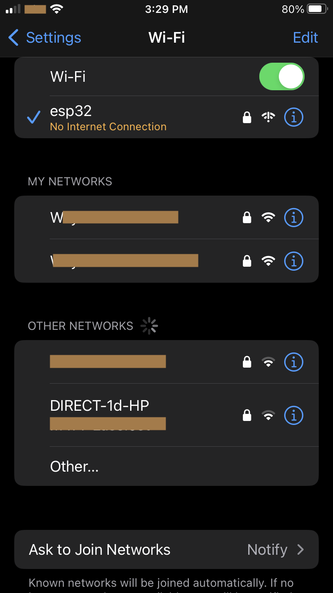
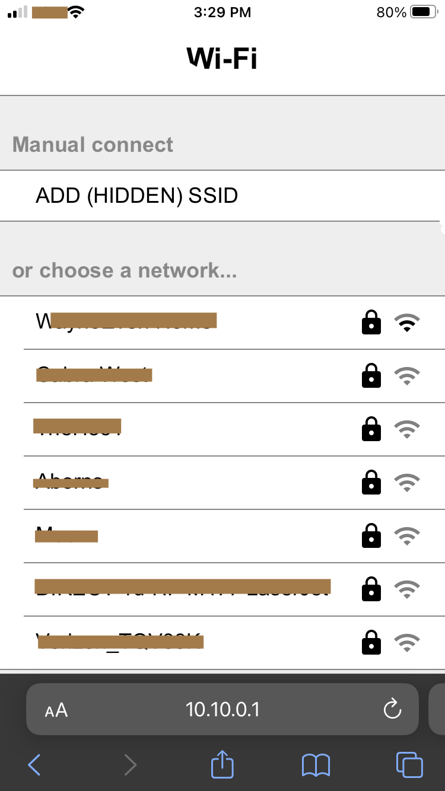
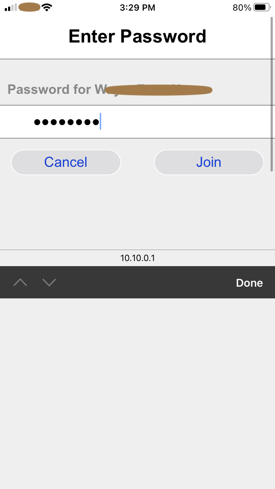

# esp32-wifi-manager V2

# Wifi Provisioning & the origin of this Repo
This repo is copied from [esp32-wifi-manager](https://github.com/tonyp7/esp32-wifi-manager). 
When use the code, I have encountered some problem (may be due to the newer esp-idf version). I then made some changes to fix bugs, and make some enhancement. Most of the original features were retained.

Note that, currently, the official [Espressif wifi provisioning](https://github.com/espressif/esp-idf/tree/v5.3.1/examples/provisioning/wifi_prov_mgr) is through an App with either BLE or SoftAP. However, when I tried to include in a big project, the memory requirement is too big and I can't solve that easily. For small project, I think you should first choose the official route.

The component here use only SoftAP and not require additional app to be download for user, besides, the size is smaller and can fit into my big project.

# Installation
To include this into your esp-idf project, add the following in your `idf_component.yaml` file

```
dependencies:
  wifi-manager:
    git: "https://github.com/wayinone/esp32-wifi-manager.git"
    path: "components/wifi_manager"
```

# Usage
1. For first time setup, the device will entering AP mode, and user should select the SSID `esp32` in the wifi setting, with password `esp32pwd`
 
   

2. Navigate to `10.10.0.1` to enter the wifi setting page.

    

3. Select the your own SSID and enter password of your WIFI. Then `join`.

     


4. (NEW FEATURE) Once success, your wifi credential is stored. First one shows the success screen when user didn't enable mDNS. Another one is when user enable mDNS (in the configuration) with `MDNS_HOSTNAME=esp32-mdns` and have `MDNS_ADD_MAC_TO_HOSTNAME=true`.
   
   
   

   Hit "Close" will close the Access Point and your phone should automatically go back to your previous WIFI setting. Then you can hit the hyper link (in this case `192.168.1.7`) to access the hello world server provided by this example.

     


# Enhancement
* Re-arrange code so that it is easier to maintain and navigate.
* Clean up some bugs that prevent the build.
* Adding a new state `WM_READY_FOR_CUSTOM_PROCESS` and it will be triggered by the following two situations when the ESP device started:
  * When there is a pre-stored wifi credential and STA is connected.
  * When user entering wifi setting page (when wifi is on the AP mode), provide connect-able wifi credential, and hit `close` button in the page.
* Adding a `close` button  (`/close-server` endpoint) in the wifi setting app, when successfully setup the correct wifi password. Also provide the ip address that the STA mode is linked in the page.

  

  * The `close-server` endpoint will trigger `WM_ORDER_STOP_AP` and then turn off the wifi setting page. 
    * It will then trigger `WM_READY_FOR_CUSTOM_PROCESS`

* Previously, after the wifi setting is done, with the linked ip address, user still access the same wifi setting page, however, in my situations, I would like to spin up my own server:
  * I created a simple function `start_hello_world_webserver()` that spin up a very simple server. 
  * User can use the `wifi_manager_set_callback` when `WM_READY_FOR_CUSTOM_PROCESS` is triggered. E.g. 
  
  ```
  #include "wifi_manager.h"

  void cb_start_custom_server(void *pvParameter)
  {
    start_hello_world_webserver();
  }

  void app_main()
  {
    /* start the wifi manager */
    wifi_manager_start();
    /* register a callback for the start of the custom server */
    wifi_manager_set_callback(WM_READY_FOR_CUSTOM_PROCESS, &cb_start_custom_server);
  }

  ```
    * This way, the custom webserver or process will be started once `WM_READY_FOR_CUSTOM_PROCESS` is triggered.
      * Previsously, the recommendation was to use `WM_EVENT_STA_GOT_IP` , however, when user just set up wifi password in the setting page, it will sometimes cause the service to hang if we want to stop the wifi setting server and start custom server (hence I implemented an extra api `close-server`)
* Adding mDNS support (**allow custom hostname for ip address**): New mDNS configuration is supported in configuration! See `idf.py menuconfig` -> `Wifi Manager Configuration` for more info.
  * `USE_BOTH_MDNS_HOSTNAME_AND_IP_IN_STA_AP` (bool, default: `false`)
  * `MDNS_HOSTNAME` (string) the resulting hose name will be `[MDNS_HOSTNAME].local` accept "a-z", "A-Z", "0-9", "-" and "_" (case insensitive).
  * `MDNS_ADD_MAC_TO_HOSTNAME` (bool) user can use this to differentiate multiple devices with same hostname.

# Configuration

This is what I use to test the code here.

#### ESP Device
esp32-cam (ESP32-CAM by AI Thinker). In PlatformIO's esp-idf extension, the target is `esp32`

#### IDE
I am building this esp-idf project on PlatformIO, with esp-idf extension.

#### esp-idf version
This is defined in `main/idf_component.yml`, currently I am running with ESP-IDF v5.3.0

# For Developer
To clean up the stored wifi credential, one can use
```
idf.py erase-flash
```
and then flash the device again.


# License
*esp32-wifi-manager* is MIT licensed. As such, it can be included in any project, commercial or not, as long as you retain original copyright. Please make sure to read the license file.
